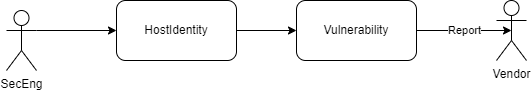

```
                   ___      ___   ___   ______    __        ______   .___________. __
                  /   \     \  \ /  /  /  __  \  |  |      /  __  \  |           ||  |
                 /  ^  \     \  V  /  |  |  |  | |  |     |  |  |  | `---|  |----`|  |
                /  /_\  \     >   <   |  |  |  | |  |     |  |  |  |     |  |     |  |
               /  _____  \   /  .  \  |  `--'  | |  `----.|  `--'  |     |  |     |  `----.
              /__/     \__\ /__/ \__\  \______/  |_______| \______/      |__|     |_______|
```


# Axolotl - ez vuln record

axolotl is a pentest collaboration tools, comes with a simple feature, and it want to keep it simple, you only need to install axolotl and git on your machine. It has a main purpose to store and collaborate all finding with your team or yourself, and axolotl process the data to simplify lookup data, make a simple statistic and generate a simple report.

<p align="center">
    
</p>

When it comes with pentestration collaboration tools, It becomes hard when you manage the document based, sometime rely on file you store on harddrive or cloud storage is hard to manage, and you need times to makes a report or statistic.


Another option, you can manage every finding with "any" pentest documentation tools, sometime with great feature generate documentation and statistic, but it comes with problem you need to pay, sometime you need to install on your server/local and have many requirement to install.


axolotl comes with a simple feature, and it want to keep it simple, you only need to install axolotl and git on your machine. It has a main purpose to store and collaborate all finding with your team or yourself, and axolotl process the data to simplify lookup data, make a simple statistic and generate a simple report.

Axolotl inspired from [nuclei](https://github.com/projectdiscovery/nuclei) project, where I'm using nuclei as the collaboration tools for poc.

# tl;dr axolotl

1. Download the binary from [Release](https://github.com/k1m0ch1/axolotl/releases)
2. Install on your machine
3. Run `axolotl init` to create new directory structure
4. Generate host identity and input as you needs (if you didn't need the key, just delete the key)
```
axolotl add -d domain.com
```
5. Generate Vulnerability Finding and input as you needs (if you didn't need the key, just delete the key)
```
axolotl add -d domain.com -v vuln-name-without-space
```
6. List all current Host
```
axolotl lookup host
```
7. List all current Vuln
```
axolotl lookup vuln
```
8. Information Host with Vuln
```
axolotl info -d domain.com
```
9. simple statistic about your finding
```
axolotl stat
```
10. repeat from `4` to add more host and vuln finding
# How to Use

To download check stable version on [Release](https://github.com/k1m0ch1/axolotl/releases)

Before everything else, you need to generate the directory structure of the axolotl, you can run this command

```
./axolotl init
```

and by default you will got this structure directory

```
dir
├── hosts       (Host Identity)
├── outputs     (Output of the template report)
├── poc         (List of the Proof of Concept)
├── reports     (Output Reports from tools)
├── templates   (List of Template for Report Generator)
├── vuln        (List of current existing finding)
└── config.yml  (General config of the axolotl)
```

ok after you init the project, next you need to understand the use of this tools, this is the flow where axolotl used:




1. whenever you want to assessment you need to understand about the Target, usually called reconaissance Process, so you need to input all the target Identity Information, this is called `HostIdentity` 

to input new host identity you need to run this command

```
./axolotl add -d <target.com>
```

and the file will be generated and you can input the information as you need, or remove the unecessary field and will look like this

```yml
id: testing.go.id
info:
  url: testing.go.id
  tech-stacks: apache:2.4.6, centos, php:5.6.38, openssl
  tag: gov, .go.id
  open-ports: 80, 443, 2000, 3306, 8008
  host-ip: 103.23.45.67
  country: indonesia

recons:
- tools: shodan domain
  type: subdomain scanner
  desc: https://beta.shodan.io/domain/testing.go.id
```

or you could see [Host-Identity-Format](.github/doc/Host-Identity-Format.md) for full format

2. and after you found some vuln you need to input new vuln from specific host, run this command to add a new vuln:

```
./axolotl add -d <target.com> -v <vuln-name-without-space>
```

the file will generated and you can input the information as you need, or remove the unecessary field and will look like this

```yaml
id: bruteforce-wa
info:
  finding-name: Bruteforce WA gojek cause crash
  url: gojek.com
  domain: gojek.com
  author: k1m0ch1
  team: ""
  email: ""
  tags: ""
  vuln-type: idor, misconfiguration
  report-template: ""
  external-terport: ""
  risk-ratings:
    severity: high
    cvss-vector: CVSS:3.1/AV:N/AC:L/PR:N/UI:N/S:U/C:N/I:N/A:N
    owasp-vector: (SL:0/M:0/O:0/S:0/ED:0/EE:0/A:0/ID:0/LC:0/LI:0/LAV:0/LAC:0/FD:0/RD:0/NC:0/PV:0)
poc:
- path: /login
  steps-to-reproduce:
  - desc: just use the script exploit
    images: []
  images: []
  nuclei-template: poc/script.yml
  payload: poc/script.py
  desc: if you bruteforce the gojek WA, the app will crash
how-to-fix: []
bounty:
  bug-link: https://gojek-bug-bounty.com
  writeup: ""
  approved-score: ""
  reward: 500USD
  desc: ""
status:
  created:
    by: k1m0ch1
    time: 2022-03-18T21:25:32+07:00
    desc: found finding
  reviewed:
    by: k1m0ch1
    time: 2022-03-18T21:30:33+07:00
    desc: found finding
```

and after that you can see the simple statistic by running this command

```
./axolotl stat
```

