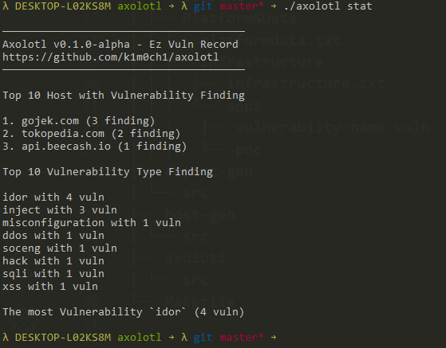

```
                   ___      ___   ___   ______    __        ______   .___________. __
                  /   \     \  \ /  /  /  __  \  |  |      /  __  \  |           ||  |
                 /  ^  \     \  V  /  |  |  |  | |  |     |  |  |  | `---|  |----`|  |
                /  /_\  \     >   <   |  |  |  | |  |     |  |  |  |     |  |     |  |
               /  _____  \   /  .  \  |  `--'  | |  `----.|  `--'  |     |  |     |  `----.
              /__/     \__\ /__/ \__\  \______/  |_______| \______/      |__|     |_______|
```

A simple bug reporting tools for hackers to input the finding and Host Identity, by record all the finding or host with git and without needs to install the tools.



This tools inspired from nuclei, where I usually working on my personal bug bounty and have a problem to record all the bug finding, while all the pentester tools have a many ability, this tools is focus on simplicity to record all security researcher activity.

## How to Use

Before everything else, you need to generate the directory structure of the axolotl, you can run this command

```
./axolotl init
```

and by default you will got this structure directory

```
dir
├── hosts       (Host Identity)
├── outputs     (Output of the template report)
├── poc         (List of the Proof of Concept)
├── reports     (Output Reports from tools)
├── templates   (List of Template for Report Generator)
├── vuln        (List of current existing finding)
└── config.yml  (General config of the axolotl)
```

ok after you init the project, next you need to understand the use of this tools, this is the flow where axolotl used:


1. whenever you want to assessment you need to understand about the Target, usually called reconaissance Process, so you need to input all the target Identity Information, this is called `HostIdentity` 

to input new host identity you need to run this command

```
./axolotl add -d <target.com>
```

and the file will be generated and you can input the information as you need, or remove the unecessary field and will look like this

```yml
id: testing.go.id
info:
  url: testing.go.id
  tech-stacks: apache:2.4.6, centos, php:5.6.38, openssl
  tag: gov, .go.id
  open-ports: 80, 443, 2000, 3306, 8008
  host-ip: 103.23.45.67
  country: indonesia

recons:
- tools: shodan domain
  type: subdomain scanner
  desc: https://beta.shodan.io/domain/testing.go.id
```

or you could see [Host-Identity-Format](.github/doc/Host-Identity-Format.md) for full format

2. and after you found some vuln you need to input new vuln from specific host, run this command to add a new vuln:

```
./axolotl add -d <target.com> -v <vuln-name-without-space>
```

the file will generated and you can input the information as you need, or remove the unecessary field and will look like this

```yaml
id: bruteforce-wa
info:
  finding-name: Bruteforce WA gojek cause crash
  url: gojek.com
  domain: gojek.com
  author: k1m0ch1
  team: ""
  email: ""
  tags: ""
  vuln-type: idor, misconfiguration
  report-template: ""
  external-terport: ""
  risk-ratings:
    severity: high
    cvss-vector: CVSS:3.1/AV:N/AC:L/PR:N/UI:N/S:U/C:N/I:N/A:N
    owasp-vector: (SL:0/M:0/O:0/S:0/ED:0/EE:0/A:0/ID:0/LC:0/LI:0/LAV:0/LAC:0/FD:0/RD:0/NC:0/PV:0)
poc:
- path: /login
  steps-to-reproduce:
  - desc: just use the script exploit
    images: []
  images: []
  nuclei-template: poc/script.yml
  exploit: poc/script.py
  desc: if you bruteforce the gojek WA, the app will crash
how-to-fix: []
bounty:
  bug-link: https://gojek-bug-bounty.com
  writeup: ""
  approved-score: ""
  reward: 500USD
  desc: ""
status:
  created:
    by: k1m0ch1
    time: 2022-03-18T21:25:32+07:00
    desc: found finding
  reviewed:
    by: k1m0ch1
    time: 2022-03-18T21:30:33+07:00
    desc: found finding
```

and after that you can see the simple statistic by running this command

```
./axolotl stat
```

